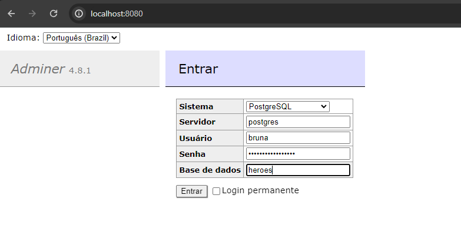
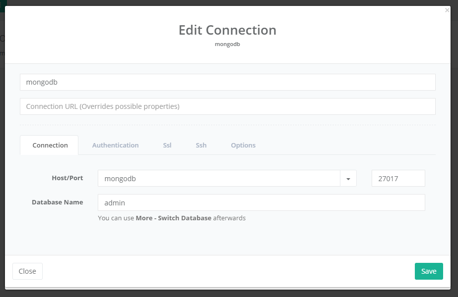
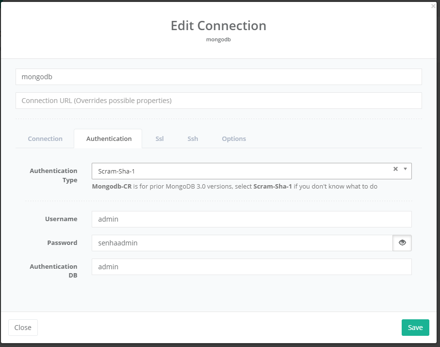

docker pull postgres

docker run \
    --name postgres \
    -e POSTGRES_USER=bruna \
    -e POSTGRES_PASSWORD=minhasenhasecreta \
    -e POSTGRES_DB=heroes \
    -p 5432:5432 \
    -d \
    postgres

-p portainterna:portaexposta

docker run --name postgres -e POSTGRES_USER=bruna -e POSTGRES_PASSWORD=minhasenhasecreta -e POSTGRES_DB=heroes -p 5432:5432 -d postgres

docker ps

docker exec -it postgres /bin/bash

docker run --name adminer -p 8080:8080 --link postgres:postgres -d adminer

acessar http://localhost:8080/

---- MONGODB
docker run --name mongodb -p 27017:27017 -e MONGO_INITDB_ROOT_USERNAME=admin -e MONGO_INITDB_ROOT_PASSWORD=senhaadmin -d mongo:4

-- client para o mongo

docker run --name mongoclient -p 3000:3000 --link mongodb:mongodb -d mongoclient/mongoclient

acessar http://localhost:3000/

Connect -> Create new

Conect

Para criar um novo usuario no mongo que nao seja o admin

docker exec -it mongodb mongo --host localhost -u admin -p senhaadmin --authenticationDatabase admin --eval "db.getSiblingDB('herois').createUser({user: 'bruna', pwd: 'minhasenhasecreta', roles: [{role: 'readWrite', db: 'herois'}]})"